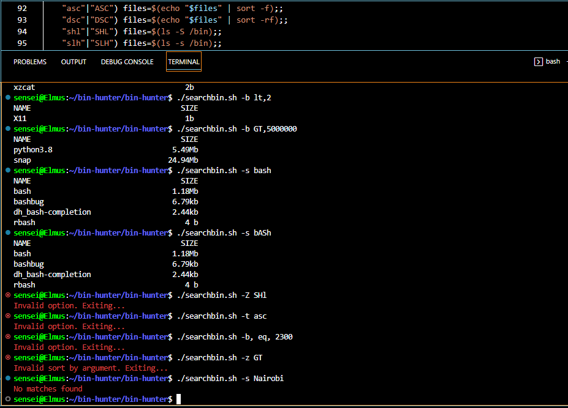

# Search and sort commands and utilities located in /bin directory

**Student name and number are included because it was one of the requirements for the script, I have tried as much as possible to implement everything the requirements stipulate**

**Note: The numbered scripts output different results when some arguments are passed to it, they were my local version control so I don't mess with the script workflow**

This bash script takes in two input arguments. The first argument is an option and the second argument is an argument. The script first validates the input arguments to ensure that the correct number of arguments are provided, and that the option and argument are valid. If the arguments are invalid, the script exits. If the arguments are valid, the script performs different actions depending on the option provided.

The options are:

"-z": sorts and displays the binary files in the /bin directory based on the argument provided (ASC, DSC, SHL, or SLH - case insensitive) and shows the name and size of the files in a columnar format.

"-s": searches for and displays the binary files in the /bin directory that match the argument provided (case-insensitive) and shows the name and size of the files in a columnar format.

"-b": filters and displays the binary files in the /bin directory based on the size argument provided (in bytes) and shows the name and size of the files in a columnar format.

To elaborate further for the b- operator;

The code first splits the argument passed with the "-b" option into two parts: an operator and a value in bytes. The operator is the first part of the argument before the comma, and the value in bytes is the second part after the comma.

If either of these two parts is not present, the script will print an error message "Invalid sort by argument. Exiting..." and exits with a return code of 1.

Then, the code uses a case statement to check the value of the operator, and maps it to a corresponding operator in Bash syntax. For example, "GT" is mapped to ">", "LT" is mapped to "<", "LE" is mapped to "<=", "GE" is mapped to ">=","EE" is mapped to "==" and "NE" is mapped to "!=". If the operator is not one of the expected values, the script will print an error message "Invalid operator for -b option. Exiting..." and exits with a return code of 1.

Finally, the script will check if the passed argument is other than "-b" and if true it will print an error message "Invalid option. Exiting..." and exits with a return code of 1.

The purpose of this code is to ensure that the option passed to the script is valid and in the correct format before continuing with the execution of the script.

The code or rather the script uses a case statement to check the value of the operator passed as an argument after the "-b" option.A case statement is a way to control the flow of a shell script by testing the value of a variable or expression against a list of patterns.

In this specific case, the script is checking the value of the operator passed as an argument and mapping it to a corresponding operator in Bash syntax.

**For example:**

if the operator passed is "GT", the script maps it to ">"
if the operator passed is "LT", the script maps it to "<"
if the operator passed is "LE", the script maps it to "<="
if the operator passed is "GE", the script maps it to ">="
if the operator passed is "EQ", the script maps it to "=="
if the operator passed is "NE", the script maps it to "!="
If the operator passed is not one of the expected values, the script will print an error message "Invalid operator for -b option. Exiting..." and exits with a return code of 1.

The exit code is a way for the script to communicate to the system the success or failure of the script's execution. The value of 0 typically indicates success and a non-zero value indicates failure. In this case, the script is exiting with a value of 1, indicating that the operator passed as an argument was not valid.

By using the case statement, the script is able to handle different variations of the operator passed as an argument and ensure that the operator passed is in the correct format before continuing with the execution of the script.

If no arguments are provided, it simply lists the files in the /bin directory.

If invalid arguments are provided, it displays an error message and exits.

## How to run the Script with different arguments

*Sorting in ascending order: "./searchbin.sh -z ASC" or "bash searchbin.sh -z ASC"* <case-insensitive>

*Sorting in descending order: "./searchbin.sh -z DSC" or "bash searchbin.sh -z DSC"* <case-insensitive>

*Sorting by size in descending order: "./searchbin.sh -z SHL" or "bash searchbin.sh -z SHL"* <case-insensitive>

*Sorting by size in ascending order: "./searchbin.sh -z SLH" or "bash searchbin.sh -z SLH"*

*Searching for files containing a specific string: "./searchbin.sh -s <string>" or "bash searchbin.sh -s <string>"*

*Sorting by file size based on a specific operator and bytes: "./searchbin.sh -b <operator,bytes>" or "bash searchbin.sh -b <operator,bytes>"*

*Displaying the full listing of /bin directory: "./searchbin.sh" or "bash searchbin.sh"*
