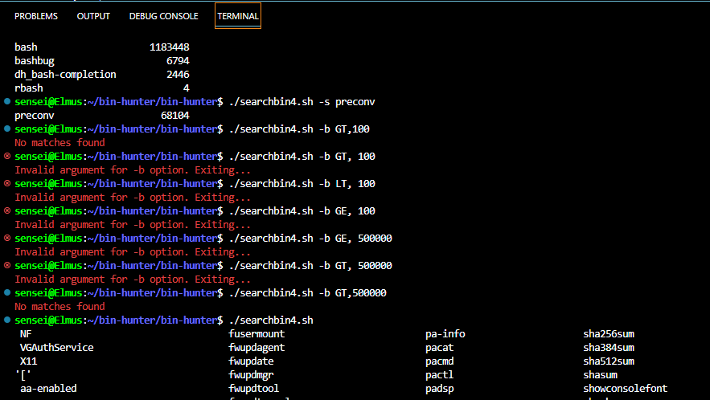

# Search and sort commands and utilities located in /bin directory
<<<<<<< HEAD
=======

<Student_name_and_number_are_included_because_it_was_one_of_the_requirements_for_the_script_have_tried_as_much_as_possible_to__mplement_everything_the_requirements_demand>
>>>>>>> 2ef193f4797301447413be3c85803e047b0d2f5c

**Student name and number are included because it was one of the requirements for the script, I have tried as much as possible to implement everything the requirements stipulate**

**Note: The numbered scripts output different results when some arguments are passed to it, they were my local version control so I don't mess with the script workflow**

This bash script takes in two input arguments. The first argument is an option and the second argument is an argument. The script first validates the input arguments to ensure that the correct number of arguments are provided, and that the option and argument are valid. If the arguments are invalid, the script exits. If the arguments are valid, the script performs different actions depending on the option provided.

The options are:

"-z": sorts and displays the binary files in the /bin directory based on the argument provided (ASC, DSC, SHL, or SLH - case insensitive) and shows the name and size of the files in a columnar format.

"-s": searches for and displays the binary files in the /bin directory that match the argument provided (case-insensitive) and shows the name and size of the files in a columnar format.

"-b": filters and displays the binary files in the /bin directory based on the size argument provided (in bytes) and shows the name and size of the files in a columnar format.

If no arguments are provided, it simply lists the files in the /bin directory.

If invalid arguments are provided, it displays an error message and exits.

## How to run the Script with different arguments

*Sorting in ascending order: "./searchbin.sh -z ASC" or "bash searchbin.sh -z ASC"* <case-insensitive>

*Sorting in descending order: "./searchbin.sh -z DSC" or "bash searchbin.sh -z DSC"* <case-insensitive>

*Sorting by size in descending order: "./searchbin.sh -z SHL" or "bash searchbin.sh -z SHL"* <case-insensitive>

*Sorting by size in ascending order: "./searchbin.sh -z SLH" or "bash searchbin.sh -z SLH"*

*Searching for files containing a specific string: "./searchbin.sh -s <string>" or "bash searchbin.sh -s <string>"*

*Sorting by file size based on a specific operator and bytes: "./searchbin.sh -b <operator,bytes>" or "bash searchbin.sh -b <operator,bytes>"*

*Displaying the full listing of /bin directory: "./searchbin.sh" or "bash searchbin.sh"*
